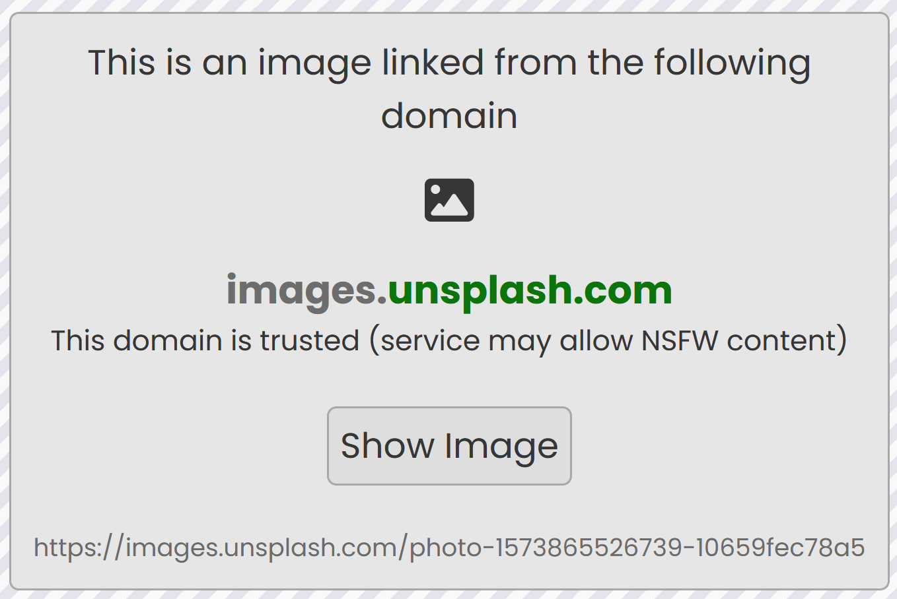
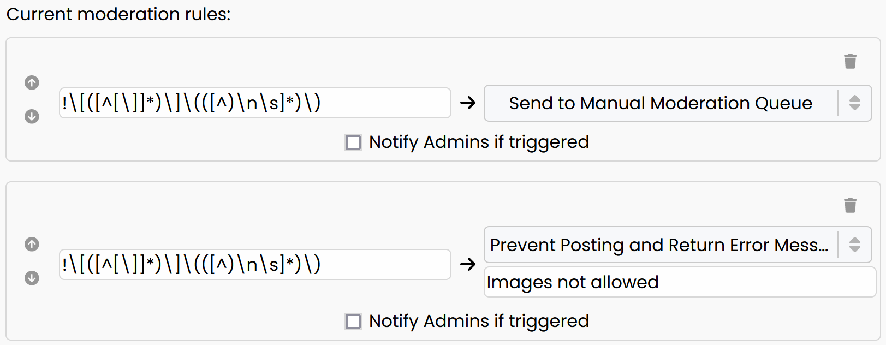
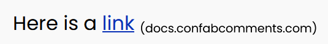

# Risks of User Generated Content

## Images

Images are defined in Markdown with the syntax ``. When a visitor loads Confab, and a comment is loaded that contains an image, the browser makes a GET request to the URL of the image to download the image to the client so that it can be displayed.

This feature could be abused by a bad actor to get information about visitors to your site. All that would be required is to submit a comment that contains an image with a URL that the bad actor controlled. E.g. ``. Every visitor that loaded this comment would now make a request to this URL. 

To prevent this, you have several options. Manually moderating any comments that contain images is recommended. Images in comments awaiting moderation are not immediately loaded, allowing an Admin to manually verify safety.

<figure markdown>
{ width="400" }
<figcaption>An image placeholder is shown to Admins to help evaluate the safety of the hosted URL before loading the image</figcaption>
</figure>

To send comments with images to the moderation queue, either [enable manual moderation for all comments](../../config/index.md#manual-moderation), or create an Automoderation Rule as described below in [Blocking Images](#blocking-images), with the action "Send to Manual Moderation Queue". 

Since it is also possible to edit comments to change its contents, for maximum safety, [disable comment editing altogether](../../config/index.md#edits), or [block edits that contain images](#blocking-edits).

In addition to safety risks, visitors may submit images that contain NSFW(1) content. If you do not wish to allow this content on your site, this is another reason to screen images manually.
{ .annotate }

1. "Not Safe For Work". Content that may be considered inappropriate or offensive

### Blocking Images

To block images from being posted altogether, [create an Automoderation rule](../../core-functionality/auto-moderation/index.md) with the following RegEx.

#### Image Regex
```
!\[([^[\]]*)\]\(([^)\n\s]*)\)
```

You may choose to have the action of your Automoderation rule be to **block posting**, presenting a message such as "Images not allowed". Alternatively, you can set the Automoderation action to **send the comment to the Manual Moderation Queue**. 

#### Blocking Edits

If you have chosen to send comments containing images to the Manual Moderation Queue, you may also wish to block edits that contain images (since edits cannot be sent to the Manual Moderation Queue).

For such a setup, you will want to use the [provided image RegEx](#image-regex) to create rules as follows.

<figure markdown>

<figcaption>The first rule will trigger on new comments, but not for an edit, so the second rule will block edits with an image</figcaption>
</figure>


## Links

Links pose a degree of risk, as they can potentially navigate users to unsafe sites. Confab attempts to reduce this risk by presenting the domain that a visitor will be taken to from a link.

<figure markdown>
{ width="300" }
</figure>

However, if you would like to disable links entirely, an [Automoderation rule](../../core-functionality/auto-moderation/index.md) may be created using the following RegEx.

#### Link Regex
```
(^|[^!])\[([^[\]]*)\]\(([^)\n\s]*)\)
```

*[RegEx]: Regular Expression