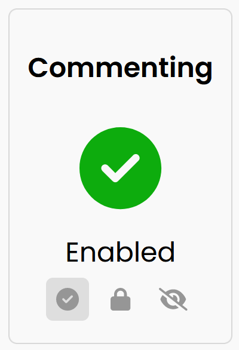
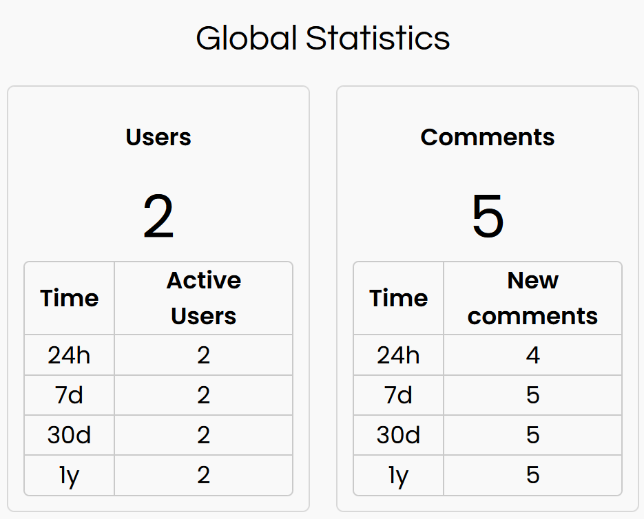

# Admin Panel

The Admin panel allows you to control many Confab settings directly from the Confab UI. 

!!! info
    The Admin panel is only visible on the Confab UI frontend if an Admin is currently logged in.

## Screenshot

<figure markdown>
{ width="150" }
</figure>

## Commenting Settings

!!! note
    If the current commenting [location](../location/index.md) has not been initialised, the Local Comment Settings section will not show any settings, and will instead show a single panel which you must select to initialise the current location. Learn more about [initialising comment locations](../location/index.md#enabling-new-location).

### Commenting

Commenting can be set globally, or for the current location. **Enable** :fontawesome-solid-circle-check: allows normal commenting, **Lock** :fontawesome-solid-lock: disables commenting, while keeping existing comments visible, and **Hide** :fontawesome-solid-eye-slash: hides comments and disables new comments.

If local setting is **Lock** or **Hidden**, this overrides a more permissive global setting.

### Voting

Voting on comments can be set globally, or for the current location. **Enable** :fontawesome-solid-circle-check: allows normal voting, **Disable** :fontawesome-solid-circle-xmark: disables voting (keeps existing votes).

If local setting is **Disabled**, this overrides the global setting.

### Editing

Editing can be disabled for the current location. **Enable** :fontawesome-solid-circle-check: allows normal editing, **Disable** :fontawesome-solid-circle-xmark: prevents editing.

!!! tip
    To change global editing settings, see the [backend configuration reference](../../config/index.md#edits).

## User Settings

### User Login

Control whether users can login or not. When disabled, users (excluding Admins) will not be able to login. **Enable** :fontawesome-solid-circle-check: allows normal login, **Disable** :fontawesome-solid-circle-xmark: prevents logins.

### Account Creation
Control whether new accounts can be created. When disabled, existing users can login, but new accounts cannot. **Enable** :fontawesome-solid-circle-check: allows new accounts, **Disable** :fontawesome-solid-circle-xmark: prevents logins from new accounts.

### Sign Out All Users
Signs out all users. Click :fontawesome-solid-right-to-bracket: to log out all signed in users.

!!! note
    This will also log out Admins. You will have to log back in yourself after pressing this button.

## Email Comment Notification Settings

!!! info
    Learn more about the [types of emails](../emails/index.md) that Confab sends.

### Admin (New Comments)

Admins receive an email notification when a new comment is submitted. This setting can be set globally or for the current location. **Enable** :fontawesome-solid-circle-check: sends notifications, **Disable** :fontawesome-solid-circle-xmark: turns off these notifications.

If local setting is **Disabled**, this overrides the global setting.

### Admin (Edits)

Admins receive an email notification when a comment is edited. This setting can be set globally or for the current location. **Enable** :fontawesome-solid-circle-check: sends notifications, **Disable** :fontawesome-solid-circle-xmark: turns off these notifications.

If local setting is **Disabled**, this overrides the global setting.

### User (Own Replies)

Users receive an email notification when their own comments receive replies. This setting can be set globally or for the current location. **Enable** :fontawesome-solid-circle-check: allows these notifications, **Disable** :fontawesome-solid-circle-xmark: turns off these notifications.

If local setting is **Disabled**, this overrides the global setting.

!!! note
    Users can also disable reply notifications themselves on the Confab Main Menu.

    If they choose to set this to **Disabled**, this overrides both the global and local setting set on the Admin Panel

## Global Statistics

Displays some basic statistics about your Confab instance, including user counts and comment counts over various time ranges.

<figure markdown>
{ width="400" }
</figure>

## Configuration

Contains additional sections with further configuration options. Currently contains the [Automoderation Panel](../auto-moderation/index.md).