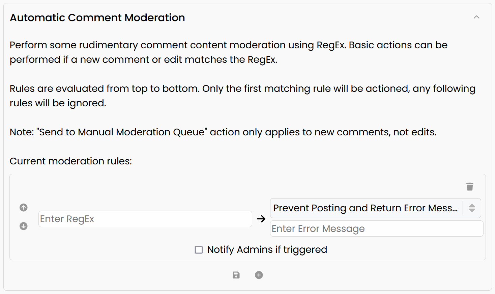

# Automatic Moderation

Confab includes the ability to perform some rudimentary automatic moderation using RegEx. 

!!! info
    The Automoderation rules are configurable in the menu found at the bottom of the [Admin Panel](../admin-panel/index.md), which is only visible when an Admin is currently logged in.

## Screenshot

## Usage

!!! tip "Admin Comments"

    Automoderation rules will not be evaluated or actioned for comment submissions or edits by Admins

Create a new rule by clicking the **plus** :fontawesome-solid-circle-plus: icon at the bottom of the panel. Existing rules can be deleted using the **trash** :fontawesome-solid-trash: icon on the top right of each rule. Save the current rules using the **save** :fontawesome-solid-floppy-disk: button at the bottom of the panel.

Rules are evaluated from top to bottom, you can reorder rules using the **up** :fontawesome-solid-circle-arrow-up: or **down** :fontawesome-solid-circle-arrow-down: arrows on the left of each rule.

The RegEx associated with each rule will be evaluated against all comment **creations** and **edits**. If there is a successful match, the action of the rule will execute.

!!! danger "Ensure RegEx is Valid"

    If any Automoderation rules contain an invalid RegEx, **visitors will not be able to submit comments**. The Confab server will return a `500: Internal Server Error`, and the error will show up in your server log.

### Notify Admins

If "Notify Admins if triggered" is ticked, an email will be sent to all Admins containing the rule that was triggered, and the comment contents that triggered the rule.

*[RegEx]: Regular Expression

## Actions

When the contents of a new or edited comment matches the given RegEx, the following actions can be taken:

- **Prevent Posting and Return Error Message**: When the user attempts to submit the comment, the comment will not be posted, and the user will receive your specified error message.
- **Ban User**: User will be banned from posting further comments.
- **Ban User and Delete All Comments**: User will be banned from posting further comments, and all of their existing comments will be deleted.
- **Send to Manual Moderation Queue**: The comment will be sent to the Manual Moderation Queue for Admin approval (even if Manual Moderation is disabled).
- **Notify Admins**: Notifies admins (same as the "Notify Admins if triggered" option).

## Anonymous Comments

Automoderation rules work for anonymous comments as well. However behaviour may differ slightly. For example, the ban action will ban the IP address of the anonymous user rather than the account.