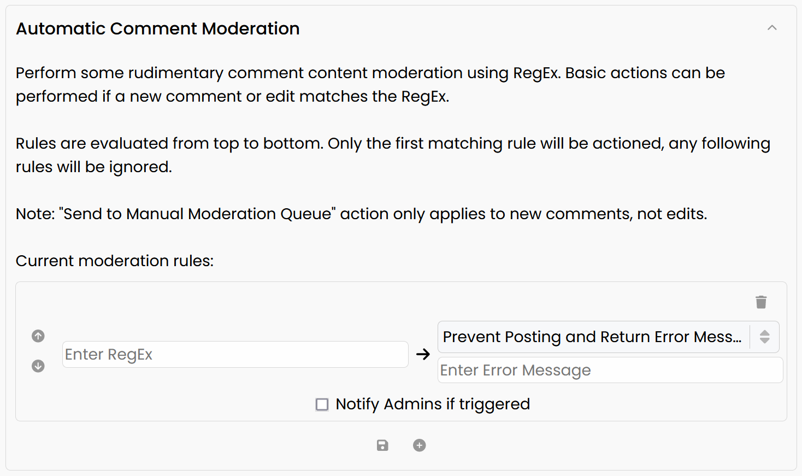

# Automatic Moderation

Confab includes the ability to perform some rudimentary automatic moderation using RegEx. 

!!! info
    The Automoderation rules are configurable in the menu found at the bottom of the [Admin Panel](../admin-panel/index.md), which is only visible when an Admin is currently logged in.

## Screenshot

## Usage

!!! tip "Admin Comments"

    Automoderation rules will not be evaluated or actioned for comment submissions or edits by Admins

Create a new rule by clicking the **plus** :fontawesome-solid-circle-plus: icon at the bottom of the panel. Existing rules can be deleted using the **trash** :fontawesome-solid-trash: icon on the top right of each rule. Save the current rules using the **save** :fontawesome-solid-floppy-disk: button at the bottom of the panel.

Rules are evaluated from top to bottom, you can reorder rules using the **up** :fontawesome-solid-circle-arrow-up: or **down** :fontawesome-solid-circle-arrow-down: arrows on the left of each rule.

The RegEx associated with each rule will be evaluated against all comment **creations** and **edits**. If there is a successful match, the action of the rule will execute.

!!! danger "Ensure RegEx is Valid"

    If any Automoderation rules contain an invalid RegEx, **visitors will not be able to submit comments**. The Confab server will return a `500: Internal Server Error`, and the error will show up in your server log.

### Notify Admins

If "Notify Admins if triggered" is ticked, an email will be sent to all Admins containing the rule that was triggered, and the comment contents that triggered the rule.

*[RegEx]: Regular Expression