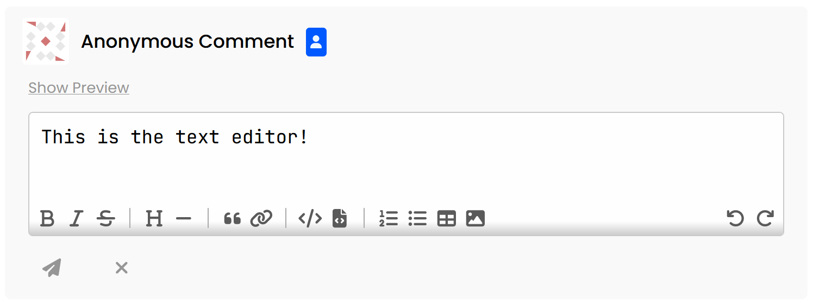

# Comments

Comments in Confab support Markdown. Users have access to a range of different text formatting and styling options, in addition to components such as code blocks (with syntax highlighting), tables, images, etc. all of which are rendered beautifully.

## Base Functionality

- :fontawesome-solid-chevron-up: Upvote/ :fontawesome-solid-chevron-down: Downvote (1)
    { .annotate }

    1. This feature can be [disabled in the Admin Panel](../admin-panel/index.md#voting) 

- :fontawesome-solid-reply: Create a new reply (1) 
    { .annotate }

    1. This feature can be [disabled in the Admin Panel](../admin-panel/index.md#commenting) 

- :fontawesome-solid-link: Copy link to comment
- View edit history (1)
    { .annotate }

    1. Learn more about the [edit history panel](../edit-history/index.md). This feature can be configured, see the [configuration reference](../../config/index.md#edits) for more info

Additionally, users have the following functionality on their own comments:

- :fontawesome-solid-pencil: Editing comments (1)
    { .annotate }

    1. This feature can be [disabled in the Admin Panel](../admin-panel/index.md#editing). For additional settings see the [configuration reference](../../config/index.md#edits) to learn more.

- :fontawesome-solid-trash-can: Deleting comments

## Administration Functionality

In addition to user functionality, Administrators are able to do the following to any comments:

- :fontawesome-solid-trash-can: Delete/ :fontawesome-solid-trash-can-arrow-up: Undelete comments (1)
    { .annotate }

    1. Learn why this action does not permanently delete [below](#deletion)

- :fontawesome-solid-trash-can: Permanently delete comments (1)
    { .annotate }

    1. Learn more about [permanent deletion](#permanent-deletion)

- :fontawesome-solid-user-slash: Ban/ :fontawesome-solid-user-plus: Unban user (1)
    { .annotate }

    1. Learn more about [user bans](../users/index.md#bans)

- :fontawesome-solid-dumpster-fire: Delete all user comments (1)
    { .annotate }

    1. This also permanently deletes any comments a user has in the Manual Moderation Queue. Learn more [below](#delete-all-comments)

## Editor

The comment text editor is a plain-text editor that features buttons (with tooltips) that simplifies comment creation by inserting the required syntax for text formatting and various Markdown components.

## Comment Behaviour

### Deletion

A normal deletion done by a user or an Admin only flags the comment as "Deleted", and removes public visibility. A comment in this state can be restored. This is primarily  done to preserve existing comment chains; without keeping a deleted comment in the database, any replies to that comment would also be deleted (this is what [permanent deletion](#permanent-deletion) does).

### Permanent Deletion

Permanent deletion fully removes comment data from the database, including any associated data (edit history, upvotes, downvotes, etc.). Additionally, all child comments are recursively **permanently deleted**, as comment replies could not exist without a reference to their parent.

!!! warning
    This option should only be used when necessary. The soft deletion should be used normally to preserve existing comment chains and possible historical context.

### Delete All Comments

The option to delete all of a user's comments only appears on the comment of a [banned](../users/index.md#bans) user.

Choosing this option soft deletes all of the corresponding user's comments. However, since comments that are currently awaiting moderation have not become publicly visible, it is unnecessary to soft delete these. As such, any comments in the Manual Moderation Queue will be permanently deleted.

!!! danger
    Exercise caution when using this option. If you need to reverse this process, you will have to undelete all of a user's comments one-by-one.