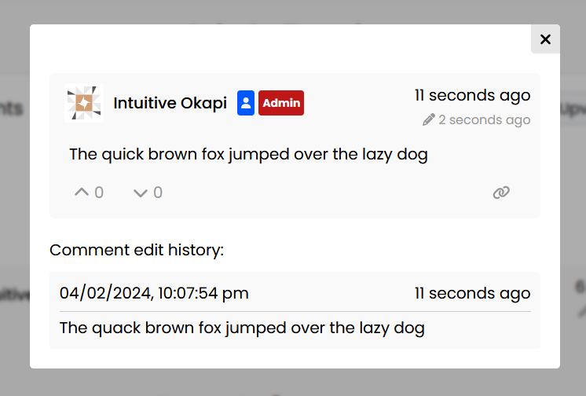

# Comment Edit History

Since comments have the ability to be edited by their authors, Confab maintains past versions of a comment in the form of edit history. The reason for this feature is for both moderation purposes, and to maintain context in the event that a comment that has replies is edited. 

The edit history of a comment is publicly visible by default. This feature, alongside the ability to edit a comment altogether, can be customised using the [Confab backend configuration](../../config/index.md#edits).

Any edits that a user makes to their comment while it is in the [Manual Moderation Queue](../manual-moderation/index.md) will not be publicly visible once the comment has been approved (but will remain visible to Admins).

## Viewing Edit History

When edit history is available for a comment, the edit icon on the top-right of a comment can be clicked to open the edit history modal.

### Screenshot

