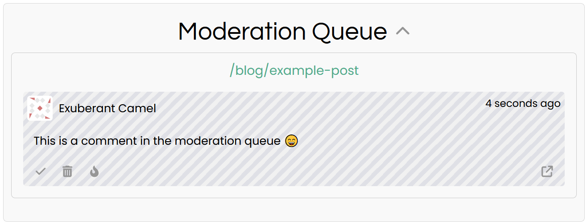

# Manual Moderation

Confab features a Manual Moderation Queue that you can configure all(1) or some(2) newly submitted comments to be sent to.
{ .annotate }

1. Set all new comments to go to the Manual Moderation Queue by changing the [backend configuration](../../config/index.md#manual-moderation)
2. Send select comments to the Manual Moderation Queue using [automoderation rules](../auto-moderation/index.md)

!!! info
    The Manual Moderation Queue panel is only visible on the Confab UI frontend if an Admin is currently logged in.

## Screenshot

## Usage

The Manual Moderation Queue panel displays comments from across your entire site (not just the current location), the comments are grouped by location, which is shown in turquoise text at the top of each group.

Click the **check mark** :fontawesome-solid-check: to approve the comment, or the **trash** :fontawesome-solid-trash: icon to **permanently** delete that comment **and all its childen**. The **link** :fontawesome-solid-up-right-from-square: button wll take you to the location of that comment.

Click the **flame** :fontawesome-solid-fire-flame-curved: icon to **permanently delete all comments awaiting moderation by that author**. This is useful for bulk-deleting spam comments.

## Awaiting Moderation Comment Behaviour

Comments awaiting moderation will have the striped background shown in the [screenshot](#screenshot) above, used to differentiate from normal comments.

A comment awaiting moderation is not publicly visible, it is only visible to the author and Admins. Additionally, only Admins can reply to a comment awaiting moderation. 

!!! warning
    Deleting a comment that is awaiting moderation will [**permanently delete**](../comments/index.md#permanent-deletion) that comment, **and also any replies to that comment by Admins**.