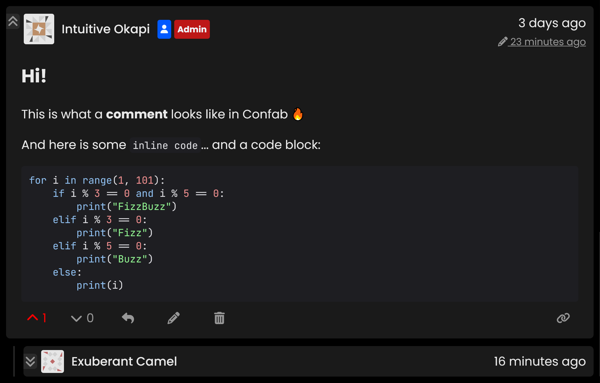

# Confab Overview

## Introduction

Confab is a drop-in commenting solution that can be easily integrated into your website using a simple `<script>` tag.

To create and vote for comments, visitors are required to be authenticated, using a one-time code sent to their email. Read more about this on our [design](../about/design.md#mandatory-authentication) page.

Confab consists of two separate parts, the [backend](#backend), and the [frontend](#confab-ui-frontend). The backend must be self-hosted by the user (e.g. on a VPS), and handles all server requirements, including storing user-generated data, and using SMTP to send emails for purposes such as user authentication and notifications.

The Confab UI (Frontend) is the user-facing part of the software, and communicates with the backend via a HTTP API. This is the part of the software that you embed into your own website. 

## Confab UI (Frontend)

Confab UI is a fast, beautiful frontend designed using [SvelteJS](https://svelte.dev/){:target="_blank"}, which embeds into your website using a simple `<script>` tag. 

### Screenshots

=== "Light Mode"

    

=== "Dark Mode"

    

### Frontend Features

- Comment creation, voting, deletion, edits, edit history
- Comment administration tools such as mass deletion, banning 
- Administration interface that allows control of global/local commenting, voting, editing, email notifications, user login, account creation, and more 
- Full Markdown support in comments
- Dark mode theme that can be toggled by dispatching a custom Javascript event
- Mobile optimised, functional at any screen size
- Manual moderation queue + custom configuration of auto-moderation rules

### Bundle Size

Confab frontend loads very fast, downloading only approx **70kB**\* of resources to be fully functional on the user's browser. 

Any required further assets are downloaded asynchronously, so your initial page load is fast. E.g. if there is a comment present that contains a code block, a further **300kB**\* of assets are downloaded asynchronously for syntax highlighting. Additionally, Administration tools assets are only downloaded if an Admin is logged in.

\* On clients that supports Brotli compression ([>97% of browsers](https://caniuse.com/brotli){:target="_blank"})

## Backend

The Confab backend is designed using [ASP.NET Core](https://dotnet.microsoft.com/en-us/apps/aspnet){:target="_blank"}, and uses SQLite as the database. 

In addition to facilitating all frontend functionality, the backend is also responsible for serving the frontend's static assets, and sending emails for user auth and notifications using SMTP.
